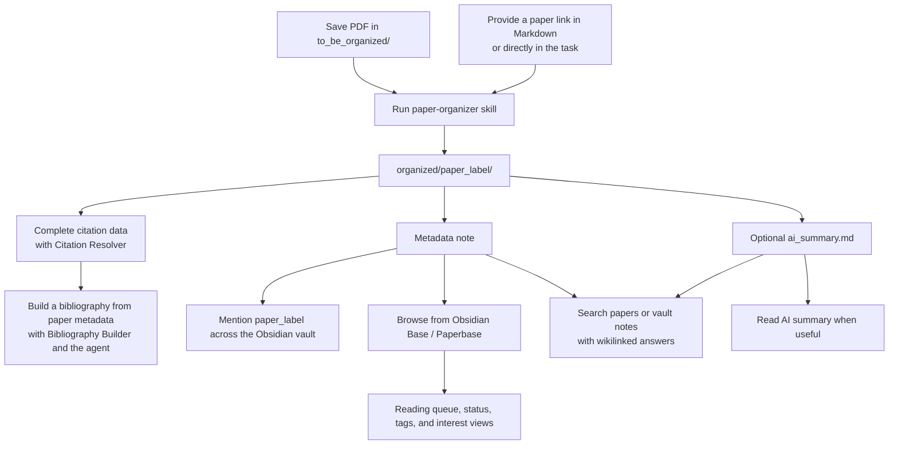
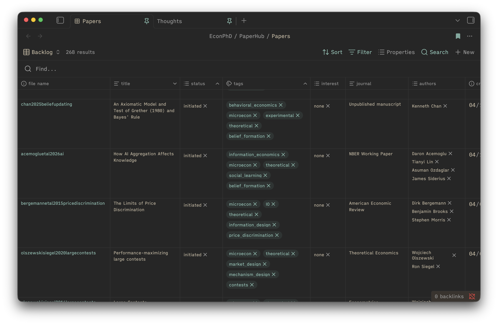

# PaperHub

PaperHub is a coding-agent-powered paper management system for Obsidian. Drop PDFs into a local inbox or provide public paper links, ask your agent to run the PaperHub skills, and get a searchable library where every paper has a stable label, metadata note, optional public PDF, optional AI summary, and Obsidian Base dashboard entry.

**ToC:** [Quick Start](#quick-start) | [Daily Workflow](#daily-workflow) | [Use Cases](#use-cases) | [Claims](#claims)

A typical paper is stored as one self-contained folder:

```text
PaperHub/
└── organized/
    └── Melitz2003HeterogeneousFirms/
        ├── Melitz2003HeterogeneousFirms.md  # metadata note
        ├── paper.pdf                        # PDF when retained
        ├── ai_summary.md                    # optional AI summary
        └── citation.csl.json                # citation information for BibTeX
```

The metadata note uses the same stable label as its folder. A retained PDF may keep its original filename, and the summary and citation information file appear only when the relevant workflow creates them.

It is built for AI-assisted knowledge work:

- `paper-organizer` turns PDFs or public paper links into one folder per paper with metadata and an optional `ai_summary.md`.
- `paper-finder` retrieves papers already stored in your PaperHub library using your vague memories, keywords, authors, tags.
- `citation-resolver` checks citation coverage and, when asked to proceed, completes standardized citation information for selected papers.
- `bibliography-builder` exports selected papers to a BibTeX `references.bib` file or an explicitly requested formatted reference list.
- `ask-knowledge-base` answers questions across visible Markdown notes in the Obsidian vault, citing notes with wikilinks; it can skip generated paper metadata/summaries when you ask for non-paper notes.
- Obsidian links and Bases make the paper label usable across notes, reading queues, and research projects.



## New Features

- `citation-resolver`: Resolve citations for existing papers or automatically attempt them for new papers.
- `bibliography-builder`: Build or safely extend `.bib` files from the paper's metadata tags.
- Reducing your switching cost: [Import an existing project collection](quick_start/usecases/import-project-literature.md).

## Quick Start

**Prerequisites:** Install [Obsidian](https://obsidian.md/) and have access to one coding agent, such as Codex, Claude Code, OpenCode, or a similar tool. Both desktop apps and command-line interfaces work.

Use the best model available (OpenAI SOTA GPT or Claude Opus w/ xhigh effort) for this one-time setup. Routine paper runs can use a faster or cheaper model (I use haiku, and it works smoothly).

1. Clone the template anywhere inside your Obsidian vault (the folder that contains `.obsidian/`). The simplest layout puts it at the vault root:

   ```text
   My Obsidian Vault/
   ├── .obsidian/
   └── PaperHub/
   ```

   but any subfolder works too (e.g. `My Obsidian Vault/Research/PaperHub/`). Run:

   ```bash
   cd "/path/to/parent/folder/inside/your/vault"
   git clone --depth 1 https://github.com/howieeeeeeeeee/paper-management-system.git PaperHub
   cd PaperHub
   rm -rf .git
   ```

2. Open Obsidian and fill in [onboarding_questionnaire.md](onboarding_questionnaire.md), then set its frontmatter status to:

   ```yaml
   status: ready_for_agent
   ```

3. Open your coding agent from the `PaperHub` folder and send:

   ```text
   Use the paper-organizer skill to onboard this project using onboarding_questionnaire.md.
   ```

## Daily Workflow

At the beginning of each session, work from your PaperHub folder. You can open a terminal and change to it:

```bash
cd "/absolute/path/to/your/PaperHub"
```

Alternatively, launch your coding agent app and open the PaperHub folder as its working folder.

### Daily Management Flow

Put new PDFs in `to_be_organized/`, then ask:

```text
/paper-organizer : metadata-only batch for everything in `to_be_organized/` using Agy CLI, Codex CLI, OpenRouter API, or the current coding agent.
```

For summaries:

```text
/paper-organizer : organize new PDFs in `to_be_organized/` with full summaries using Agy CLI, Codex CLI, OpenRouter API, or the current coding agent.
```

For a link, paste it directly into the task:

```text
/paper-organizer : add https://example.org/paper as link metadata using Agy CLI, Codex CLI, OpenRouter API, or the current coding agent.
```

You can also save links in any Markdown or plain-text note. The existing `to_be_organized/papers to find.md` is a convenient link inbox:

```text
/paper-organizer : import the links under "Paper Organizer Integration Tests"
in `to_be_organized/papers to find.md` using Codex CLI.
```

You can provide either a direct link to a PDF or a link to the paper's webpage.

### Knowledge Retrieval

For retrieval:

```text
/paper-finder : which paper was it where dictators avoided knowing the recipient's payoff?
```

Paper Finder searches the metadata note, optional `ai_summary.md`, and every other visible Markdown note inside each paper folder. Matches from lecture, presentation, model, or experiment notes count toward their parent paper rather than appearing as separate results.

For vault questions:

```text
/ask-knowledge-base : what do my notes say about strategic ignorance and moral wiggle room?
```

To search notes while skipping generated paper metadata and AI summaries:

```text
/ask-knowledge-base : search my notes about confirmation bias and large language models, without papers.
```

PaperHub and the skills in this folder are useful beyond paper management. You can ask your coding agent to search, synthesize, draft, edit, or create an Obsidian Canvas from Markdown notes anywhere in the same vault; paste the full path from your computer's system root to the relevant file or folder (for example, `/Users/your-name/Documents/My Obsidian Vault/Research/`) so the agent knows what material to use.

### Bibliography Export

For citations, begin with a read-only coverage check:

```text
/citation-resolver : audit citation coverage for papers tagged behavioral_economics.
```

Citation Resolver fills in the citation information that Bibliography Builder needs to build a BibTeX file or reference list.

To build a BibTeX database for a project:

```text
/bibliography-builder : build references.bib from papers tagged project_KMC and save it to <absolute path to the project folder>.
```

To add papers to an existing BibTeX file:

```text
/bibliography-builder : add papers tagged project_KMC to <absolute path to existing references.bib>. Keep existing entries and skip duplicates.
```

The builder shows a preflight summary before it writes output or omits any papers. You can instead request a human-readable `references.md`; formatted output is best effort, while BibTeX is the primary export.

To work with the agent to add citation information as numbered footnotes to a Markdown draft:

```text
/bibliography-builder : work with me to add citation information as numbered footnotes to <absolute path to the Markdown file>. Build references.bib and references.md beside the note first.
```

Bibliography Builder generates the reference files, while the agent reads the draft, matches each paper to the relevant text, and works with you to add the footnotes.

### Use Cases

- [Review a familiar topic from papers already in PaperHub](quick_start/usecases/review-a-familiar-topic.md): create or update a research note when you have read many related papers and need a quick refresher. This is not intended for learning a new topic.
- [Import a paper folder or BibTeX file](quick_start/usecases/import-project-literature.md): reuse existing records, batch-import the rest, tag them with `proj_xxx`, resolve citations, and keep the project's `.bib` updated.

## Obsidian Base

Use [SamplePaperBoard.base](SamplePaperBoard.base) as the main entry point for reading status, tags, interest, and topic views.


For example, here I exclude papers whose status is `archived`, `done`, or `reflecting`.


Here I filter for papers whose tags include `repeated_games`.


## Obsidian Authoring Skill

Use `paperhub-obsidian` to create or edit Obsidian Markdown, Bases, Canvas maps, or live-vault workflows. It routes each task to the relevant open-source [`kepano/obsidian-skills`](https://github.com/kepano/obsidian-skills) reference while preserving PaperHub's paper workflows and safeguards. See the short [Obsidian skill guide](quick_start/obsidian/paperhub-obsidian.md).

```text
/paperhub-obsidian : add a view to the existing SamplePaperBoard.base for high-interest papers I am currently digesting.
```

```text
/paperhub-obsidian : add a view to the existing SamplePaperBoard.base that shows only papers tagged `repeated_games`.
```

## Updating Utilities and Skills

PaperHub keeps improving — new skills, engines, and workflow features ship over time. Rather than re-cloning, run the local `update-paperhub-utils` skill to sync the latest skills and utilities into your own project, so new features land on your local copy while your papers and settings stay untouched.

Use the best model available (SOTA GPT w/ xhigh thinking or Opus w/ xhigh thinking) because updates may need semantic prompt merges:

```text
/update-paperhub-utils : check for updates and apply safe utility updates.
```

The updater focuses on skills and utility code while preserving local papers, tags, API keys, runtime config, Obsidian state, generated outputs, and customized prompts.

## Claim(s)

As an economics PhD student, I am still building up my research skill set. I do not think AI, or any automatic tool, can completely replace the process of reading the literature and building knowledge throughout the research lifecycle. I truly believe that the mental connections we form among papers while engaging with the literature cannot be outsourced to an external tool.

The main purpose of this tool is management, not summarization. The AI-augmented summary feature is meant to help users quickly skim the main idea of a new paper and decide whether it is worth reading deeply. There have been times when I remembered only a small part of a paper I had encountered but could not fully recall what it was. The `paper-finder` skill is designed to help with exactly that. There are also times when I want to save a paper for later but cannot read it immediately. This management system, built with Obsidian Bases and the `paper-organizer` skill, is my project-management-style solution to that pain point.

Ultimately, I envision PaperHub becoming my main paper database: a place where the papers I collect, read, and cite can stay connected throughout my research. I am now practicing a workflow in which I work with an agent to turn the papers already in the library into project-specific bibliographies. The `citation-resolver` skill helps complete and verify the standardized citation information for each paper, and `bibliography-builder` turns selected papers—whether chosen directly, by tags, or from a draft—into BibTeX and reference files that the agent can adapt for the work at hand.

I strongly suggest being aware of copyright before sending any downloaded PDF to AI. Open-access PDFs may be appropriate to use, but being able to download a PDF does not necessarily mean that you have the right to share it with an external AI service. When you are unsure, use the link metadata-only workflow instead.

For deep reading a PDF, I strongly recommend the Obsidian plugin [PDF++](https://github.com/RyotaUshio/obsidian-pdf-plus).


## Useful Files

- [quick_start/obsidian/obsidian-101.md](quick_start/obsidian/obsidian-101.md): Obsidian links, metadata notes, and Bases.
- [quick_start/obsidian/paperhub-obsidian.md](quick_start/obsidian/paperhub-obsidian.md): agent-assisted Markdown, Bases, Canvas, and live Obsidian workflows.
- [quick_start/use-cases.md](quick_start/use-cases.md): concise index for the skill-specific quick starts.
- [quick_start/skills/paper-organizer.md](quick_start/skills/paper-organizer.md): PDF and public-link ingestion.
- [quick_start/skills/citation-resolver.md](quick_start/skills/citation-resolver.md): read-only citation audits and completing missing citation information.
- [quick_start/skills/bibliography-builder.md](quick_start/skills/bibliography-builder.md): BibTeX and formatted reference exports.
- [paperhub_utils/config/config.json](paperhub_utils/config/config.json): runtime preferences, including which AI services have been set up.
- [paperhub_utils/utility_changelog.json](paperhub_utils/utility_changelog.json): structured utility update notes.
