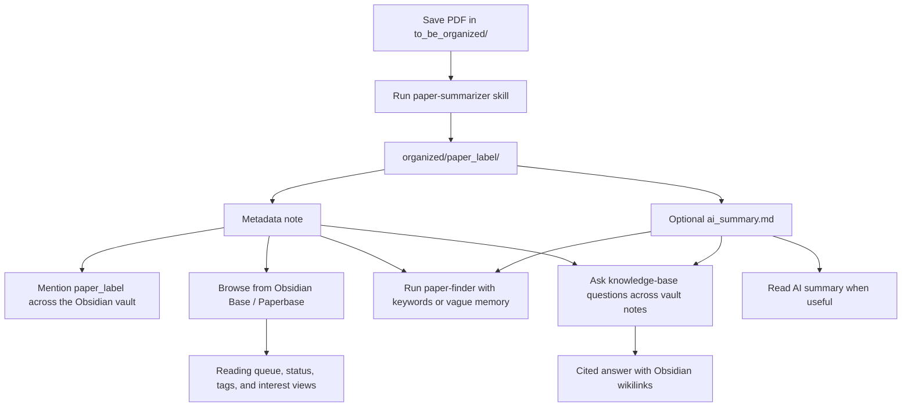

# PaperHub

PaperHub is a coding-agent-powered paper management system for Obsidian. Drop PDFs into a local inbox, ask your agent to run the PaperHub skills, and get a searchable library where every paper has a stable label, metadata note, optional AI summary, and Obsidian Base dashboard entry.

It is built for AI-assisted knowledge work:

- `paper-summarizer` turns PDFs into one folder per paper with metadata and optional `ai_summary.md`.
- `paper-finder` retrieves papers from vague memories, keywords, authors, tags, or summary snippets using local library files.
- `ask-knowledge-base` answers questions across visible Markdown notes in the Obsidian vault, citing notes with wikilinks.
- Obsidian links and Bases make the paper label usable across notes, reading queues, and research projects.



## Quick Start

Use the best model available (OpenAI SOTA GPT or Claude Opus w/ xhigh effort) for this one-time setup. Routine paper runs can use a faster or cheaper model (I use haiku, and it works smoothly).

1. Clone the template inside your Obsidian vault:

   ```bash
   git clone --depth 1 https://github.com/howieeeeeeeeee/paper-management-system.git PaperHub
   cd PaperHub
   rm -rf .git
   ```

2. Fill [onboarding_questionnaire.md](onboarding_questionnaire.md), then set its frontmatter status to:

   ```yaml
   status: ready_for_agent
   ```

3. Open your coding agent from the `PaperHub` folder and paste:

   ```text
   Use the \paper-summarizer skill to onboard this project from scratch.
   ```

## Daily Workflow

Put new PDFs in `to_be_organized/`, then ask:

```text
\paper-summarizer: metadata-only batch for everything in `to_be_organized/` using (AGY CLI / Codex CLI / OpenRouter API).
```

For summaries:

```text
\paper-summarizer: organize new PDFs in `to_be_organized/` with full summaries using (AGY CLI / Codex CLI / OpenRouter API)
```

For retrieval:

```text
\paper-finder: which paper was it where dictators avoided knowing the recipient's payoff?
```

For vault questions:

```text
\ask-knowledge-base: what do my notes say about strategic ignorance and moral wiggle room?
```

## Obsidian Base

Use [SamplePaperBoard.base](SamplePaperBoard.base) as the main entry point for reading status, tags, interest, and topic views.


## Updating Utilities and Skills 

PaperHub keeps improving — new skills, engines, and workflow features ship over time. Rather than re-cloning, run the local `update-paperhub-utils` skill to sync the latest skills and utilities into your own project, so new features land on your local copy while your papers and settings stay untouched.

Use the best model available (SOTA GPT w/ xhigh thinking or Opus w/ xhigh thinking) because updates may need semantic prompt merges:

```text
\update-paperhub-utils: check for updates and apply safe utility updates.
```

The updater focuses on skills and utility code while preserving local papers, tags, API keys, runtime config, Obsidian state, generated outputs, and customized prompts.

## Useful Files

- [quick_start/obsidian_101.md](quick_start/obsidian_101.md): Obsidian links, metadata notes, and Bases.
- [quick_start/use-cases.md](quick_start/use-cases.md): concise index for the skill-specific quick starts.
- [paperhub_utils/config/config.json](paperhub_utils/config/config.json): runtime preferences.
- [paperhub_utils/utility_changelog.json](paperhub_utils/utility_changelog.json): structured utility update notes.
