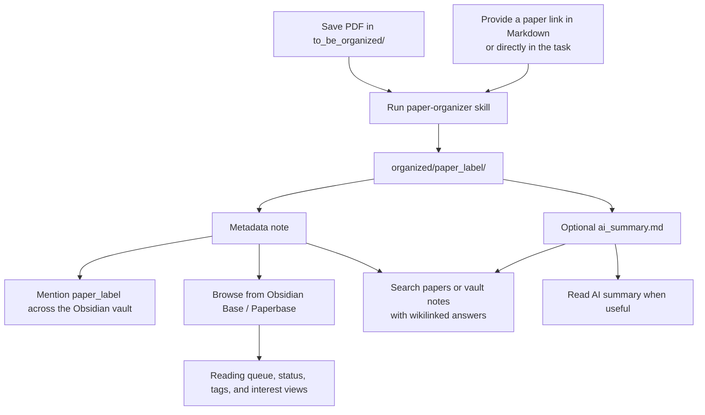
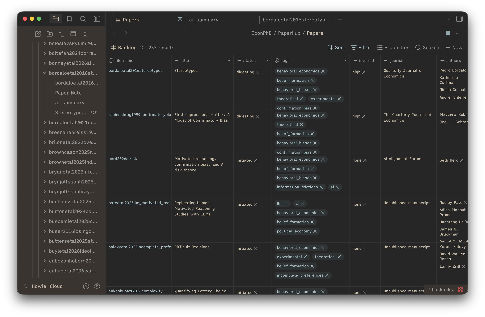

# PaperHub

PaperHub is a coding-agent-powered paper management system for Obsidian. Drop PDFs into a local inbox or provide public paper links, ask your agent to run the PaperHub skills, and get a searchable library where every paper has a stable label, metadata note, optional public PDF, optional AI summary, and Obsidian Base dashboard entry.

It is built for AI-assisted knowledge work:

- `paper-organizer` turns PDFs or public paper links into one folder per paper with metadata and an optional `ai_summary.md`.
- `paper-finder` retrieves papers from vague memories, keywords, authors, tags, or snippets across every Markdown note associated with each paper.
- `ask-knowledge-base` answers questions across visible Markdown notes in the Obsidian vault, citing notes with wikilinks; it can skip generated paper metadata/summaries when you ask for non-paper notes.
- Obsidian links and Bases make the paper label usable across notes, reading queues, and research projects.



## Claim(s)

As an economics PhD student, I am still building up my research skill set. I do not think AI, or any automatic tool, can replace the process of reading the literature and building knowledge throughout the research lifecycle. I truly believe that the mental connections we form among papers while engaging with the literature are irreplaceable and cannot be outsourced to an external tool.

The main purpose of this tool is management, not summarization. The AI-augmented summary feature is meant to help users quickly skim the main idea of a new paper and decide whether it is worth reading deeply. There have been times when I remembered only a small part of a paper I had encountered but could not fully recall what it was. The `paper-finder` skill is designed to help with exactly that. There are also times when I want to save a paper for later but cannot read it immediately. This management system, built with Obsidian Bases and the `paper-organizer` skill, is my project-management-style solution to that pain point.

I strongly suggest being aware of copyright before sending any downloaded PDF to AI. Open-access PDFs may be appropriate to use, but being able to download a PDF does not necessarily mean that you have the right to share it with an external AI service. When you are unsure, use the link metadata-only workflow instead.

For deep reading a PDF, I strongly recommend the Obsidian plugin [PDF++](https://github.com/RyotaUshio/obsidian-pdf-plus).

## Quick Start

Use the best model available (OpenAI SOTA GPT or Claude Opus w/ xhigh effort) for this one-time setup. Routine paper runs can use a faster or cheaper model (I use haiku, and it works smoothly).

1. Clone the template inside your Obsidian vault:

   ```text
   My Obsidian Vault/
   ├── .obsidian/
   └── PaperHub/
   ```

   `.obsidian/` and `PaperHub/` are sibling entries under the vault root. Run:

   ```bash
   cd "/path/to/My Obsidian Vault"
   git clone --depth 1 https://github.com/howieeeeeeeeee/paper-management-system.git PaperHub
   cd PaperHub
   rm -rf .git
   ```

2. Fill [onboarding_questionnaire.md](onboarding_questionnaire.md), then set its frontmatter status to:

   ```yaml
   status: ready_for_agent
   ```

3. Open your coding agent from the `PaperHub` folder and paste:

   ```text
   Use the \paper-organizer skill to onboard this project from scratch.
   ```

## Daily Workflow

Put new PDFs in `to_be_organized/`, then ask:

```text
\paper-organizer: metadata-only batch for everything in `to_be_organized/` using (Agy CLI / Codex CLI / OpenRouter API).
```

For summaries:

```text
\paper-organizer: organize new PDFs in `to_be_organized/` with full summaries using (Agy CLI / Codex CLI / OpenRouter API)
```

For a link, paste it directly into the task:

```text
\paper-organizer: add https://example.org/paper as link metadata using OpenRouter.
```

You can also save links in any Markdown or plain-text note. The existing
`to_be_organized/papers to find.md` is a convenient link inbox:

```text
\paper-organizer: import the links under "Paper Organizer Integration Tests"
in `to_be_organized/papers to find.md` using Codex CLI.
```

The invoking coding agent retrieves public citation data sequentially, then
separates pure links from publicly downloadable PDFs. Pure links run through the
selected external engine in parallel using prepared text only; Agy, Codex, and
OpenRouter do not browse. Public PDFs are grouped separately into metadata-only
or full-summary PDF batches.

For retrieval:

```text
\paper-finder: which paper was it where dictators avoided knowing the recipient's payoff?
```

Paper Finder searches the metadata note, optional `ai_summary.md`, and every
other visible Markdown note inside each paper folder. Matches from lecture,
presentation, model, or experiment notes count toward their parent paper rather
than appearing as separate results.

For vault questions:

```text
\ask-knowledge-base: what do my notes say about strategic ignorance and moral wiggle room?
```

To search notes while skipping generated paper metadata and AI summaries:

```text
\ask-knowledge-base: search my notes about confirmation bias and large language models, without papers.
```

## Obsidian Base

Use [SamplePaperBoard.base](SamplePaperBoard.base) as the main entry point for reading status, tags, interest, and topic views.



## Updating Utilities and Skills 

PaperHub keeps improving — new skills, engines, and workflow features ship over time. Rather than re-cloning, run the local `update-paperhub-utils` skill to sync the latest skills and utilities into your own project, so new features land on your local copy while your papers and settings stay untouched.

Use the best model available (SOTA GPT w/ xhigh thinking or Opus w/ xhigh thinking) because updates may need semantic prompt merges:

```text
\update-paperhub-utils: check for updates and apply safe utility updates.
```

The updater focuses on skills and utility code while preserving local papers, tags, API keys, runtime config, Obsidian state, generated outputs, and customized prompts.

## Useful Files

- [quick_start/obsidian/obsidian-101.md](quick_start/obsidian/obsidian-101.md): Obsidian links, metadata notes, and Bases.
- [quick_start/use-cases.md](quick_start/use-cases.md): concise index for the skill-specific quick starts.
- [quick_start/skills/paper-organizer.md](quick_start/skills/paper-organizer.md): PDF and public-link ingestion.
- [paperhub_utils/config/config.json](paperhub_utils/config/config.json): runtime preferences.
- [paperhub_utils/utility_changelog.json](paperhub_utils/utility_changelog.json): structured utility update notes.
